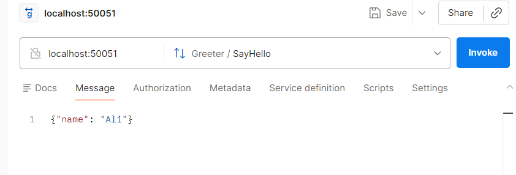
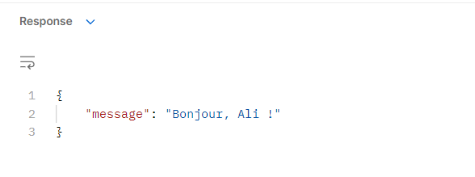

# gRPC Project 
##  Overview

This project demonstrates the use of **gRPC (Google Remote Procedure Call)** with **Protocol Buffers (Protobuf)** using Node.js.

It implements a simple **client-server architecture** where a client sends a request and receives a response from a gRPC server.

---

##  Technologies Used

- Node.js
- gRPC 
- Protocol Buffers
- protoLoader

## Testing

Test 
 test result 